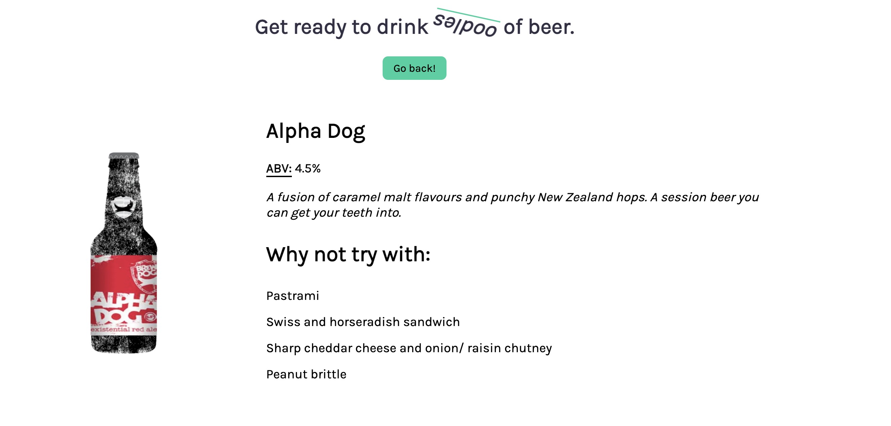

# Beer Fetcher

> The only app you'll want to <em>oodle</em> over.

## The App

If you'd like to visit the page, please click [here](https://beer-fetcher-akharouk.vercel.app/).

Application was built using NextJS with React. I was able to implement the logic for fetching the data from [Punk's API](https://api.punkapi.com/v2/beers). It calls the API during build time, fetching the data and populating the HTML beforehand. Therefore, both the list of beers and the beer detail pages are statically generated.

I tried to keep it as semantic as possible. Design wise, I tried to make sure it was mobile friendly, however if I had more time I would make sure it was indeed tested on all devices, maybe using a tool like Browserstack.

Also tried to keep performance in as according to Lighthouse:

## Run the Application

#### 1. Install Dependencies

`npm i` or `yarn`

#### 2. Run the Development Server

`npm run dev`

#### 2b. Alternatively, build the project and start it.

`npm run build && npm start`

#### 3. Run the tests.

`npm test`

## Improvements

- Maybe use Next's [Incremental Static Regeneration](https://nextjs.org/docs/basic-features/data-fetching#incremental-static-regeneration) for the index page just in case the data that we pull from the API does get updated, and our changes won't be reflected unless we rebuild.
- Add even more testing around the React components.
- Use Typescript instead of Javascript.
- Improve that SEO Score!
